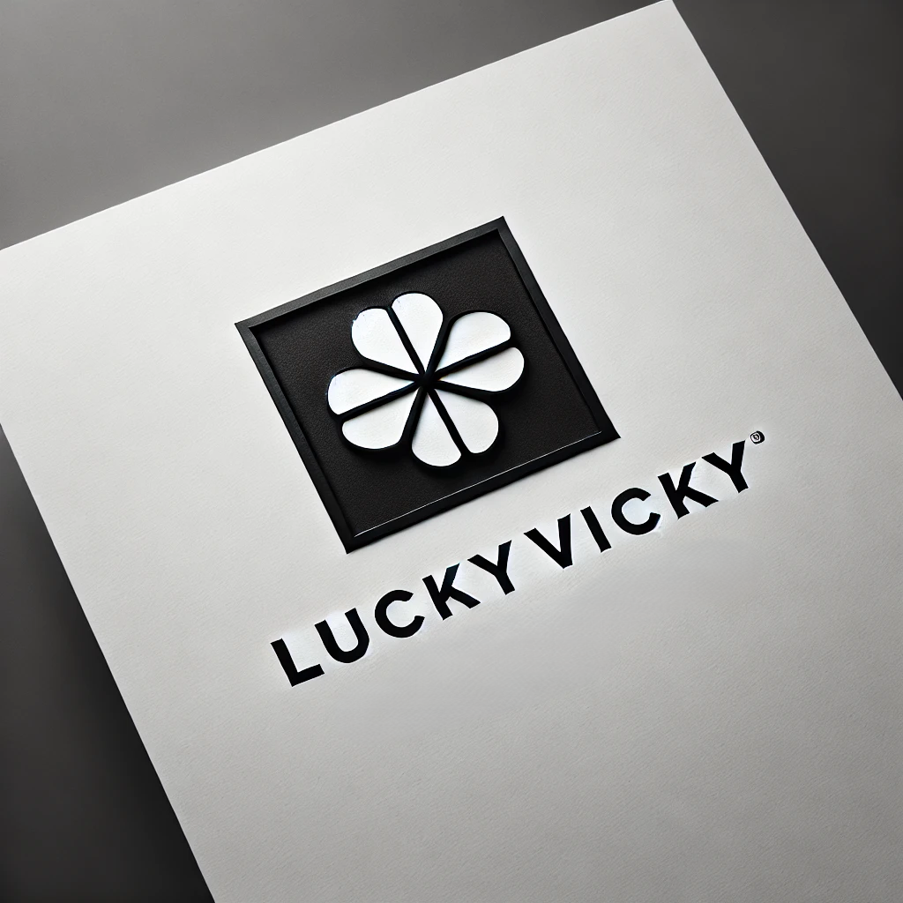

<h1 align="center">LuckyVicky's WriteUp</a></h1>

  <em>NIS Digital Forensics Challenge 2024 
  <em>The write-up of the top winning team

    

## 🏆 Challenge Overview
Hosted by the National Intelligence Service(NIS), the Digital Forensics Challenge 2024(DFC 2024) aims to expand our knowledge of digital forensics and to contribute to this field. Now in its seventh year, it plays a significant role in developing new technologies and training forensic experts such as researchers and graduate students in the field of information security. This year, the number of participants recorded a total of 796 people from 452 teams, with 361 Korean and 91 International teams.

## ⛳️ Description
This challenge consists of 20 problems and they have 100, 150, 200, 250, 300, 350. Unlike last year, this time the questions were released all at once, and the deadline was October 8th. There is no limit to the number of submissions within the due date, but the last submission will be graded. And there is a disadvantage when submitting after the due date.

> QUALIFICATION 
– Anyone interested in Digital Forensics. 
– Participants can register individually or as a team. 
– The maximum number of team members is Four.

> PARTICIPATION 
– Participants can use any tool. (No Limitation) 
– You can write answer-sheet in English or Korean. 
– Sharing answers or codes is not permitted.

## 🎉 Result
This is the final score and ranking of the top 5 teams.
To check the scores of more teams, access the [rank page](https://dfchallenge.org/digital-forensics-challenge-2024-ranking/).

| Rank | Name | Final Score | Nation |
|----|----------|---------|---------|
|🥇  | <strong>LuckyVicky</strong> | 3650 | Korea (South) |
|🥈  | <strong>Dofarming</strong> | 3495 | Korea (South) |
|🥉  | <strong>King_Baht_Zoo</strong> | 3200 | Korea (South) |
|4   | <strong>YeolGeoBul</strong> | 3185 | Korea (South) |
|5   | <strong>bi0s</strong> | 2945 | India |

## ⚔️ WriteUp

We do not provide <strong>source codes</strong> and <strong>image files</strong> used in challenge, but only <strong>write-ups</strong>.

## 🐥 100-points problems

| No | Problems | Keyword | Score | Main Author |
|----|----------|---------|-------|-------------|
| 101 | <strong>[Darkverse](./writeup/[LuckyVicky][101].pdf)</strong> | Vr, Metaverse | 100 | Eungchang Lee (Financial Security Institute) |
| 102 | <strong>[Windows Lateral Movement](./writeup/[LuckyVicky][102].pdf)</strong> | Impacket | 50 | Eungchang Lee (Financial Security Institute) |
| 103 | <strong>[How is EDR data written](./writeup/[LuckyVicky][103].pdf)</strong> | Vehicle_forensic | 100 | Hyun Yi |
| 104 | <strong>[PDF classification](./writeup/[LuckyVicky][104].pdf)</strong> | File_format | 100 | Eungchang Lee (Financial Security Institute) & Hyun Yi |
| 105 | <strong>[Where were you](./writeup/[LuckyVicky][105].pdf)</strong> | Metadata | 100 | Juho Heo |

## 🦩 150-points problems

| No | Problems | Keyword | Score | Main Author |
|----|----------|---------|-------|-------------|
| 151 | <strong>[Careless Drug Dealer](./writeup/[LuckyVicky][151].pdf)</strong> | ExFAT, Timezone | 150 | Eungchang Lee (Financial Security Institute) |
| 152 | <strong>[Reconnaissance](./writeup/[LuckyVicky][152].pdf)</strong> | Prompt | 150 | Eungchang Lee (Financial Security Institute) |

## 🦉 200-points problems

| No | Problems | Keyword | Score | Main Author |
|----|----------|---------|-------|-------------|
| 201 | <strong>[Cloud Investigation](./writeup/[LuckyVicky][201].pdf)</strong> | AWS, IaC | 120 | Juho Heo |
| 202 | <strong>[Reconstruct RAID](./writeup/[LuckyVicky][202].pdf)</strong> | Raid | 200 | Juho Heo |
| 203 | <strong>[Where did the data go](./writeup/[LuckyVicky][203].pdf)</strong> | Dataleak | 170 |  Eungchang Lee (Financial Security Institute), Hyun Yi |
| 204 | <strong>[Find & Insert Resolution](./writeup/[LuckyVicky][204].pdf)</strong> | Standard, Encoding_parameter | 200 | Eungchang Lee (Financial Security Institute) |
| 205 | <strong>[Analyze Drone Log File](./writeup/[LuckyVicky][205].pdf)</strong> | Drone, Log_analysis | 200 | Eungchang Lee (Financial Security Institute) |
| 206 | <strong>[Analyze Drone File](./writeup/[LuckyVicky][206].pdf)</strong> | Drone, Binary_analysis, Decryption | 200 | Dongkyu Lee (Shinhan DS) |
| 207 | <strong>[Maze of Traffic](./writeup/[LuckyVicky][207].pdf)</strong> | Network, Dataleak | 200 | Juho Heo |
| 208 | <strong>[Find the cryptocurrency wallet password](./writeup/[LuckyVicky][208].pdf)</strong> | Wallet, Password | 200 | All |

## 🐉 250-points problems

| No | Problems | Keyword | Score | Main Author |
|----|----------|---------|-------|-------------|
| 251 | <strong>[Time is a Masterpiece](./writeup/[LuckyVicky][251].pdf)</strong> | DVR, Time_info | 250 | Eungchang Lee (Financial Security Institute) |

## ⌛️ 300-points problems

| No | Problems | Keyword | Score | Main Author |
|----|----------|---------|-------|-------------|
| 301 | <strong>[App Sleuth](./writeup/[LuckyVicky][301].pdf)</strong> | Android, Reversing, Misc | 300 | Dongkyu Lee (Shinhan DS) |
| 302 | <strong>[Android Malicious App](./writeup/[LuckyVicky][302].pdf)</strong> | Android | 300 | Dongkyu Lee (Shinhan DS) |
| 303 | <strong>[RealmDB Record Recovery](./writeup/[LuckyVicky][303].pdf)</strong> | Realmdb | 210 | Hyun Yi |

## 🚀 350-points problems

| No | Problems | Keyword | Score | Main Author |
|----|----------|---------|-------|-------------|
| 351 | <strong>[Tracing the Data Breach](./writeup/[LuckyVicky][351].pdf)</strong> | Dataleak | 350 | All |

## 📝 Author
If you want to contact us, please send at this [email](mailto:dfc_luckyvicky@googlegroups.com).

## 🎙 Challenge Hosted by

## 🎭 Challenge Organizer

## 📌 License
This license lets others remix, adapt, and build upon your work non-commercially, as long as they credit you and license their new creations under the identical terms.

